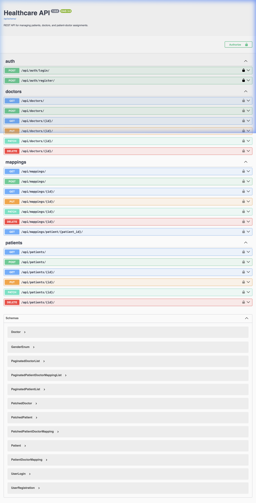
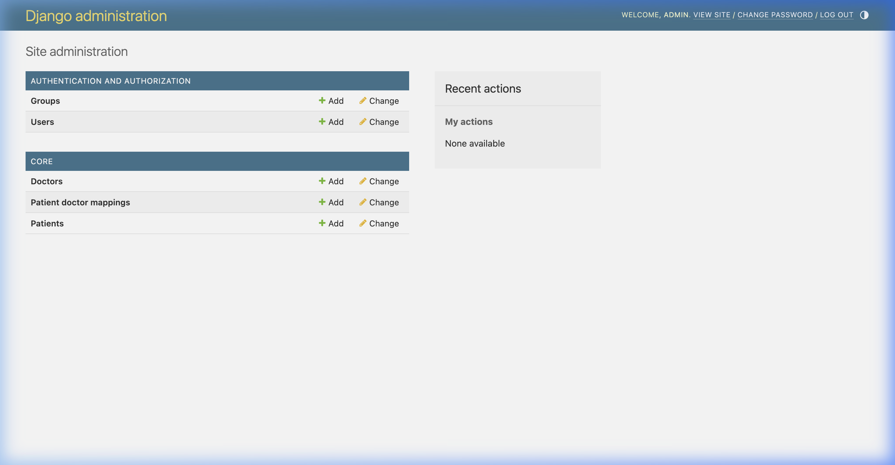
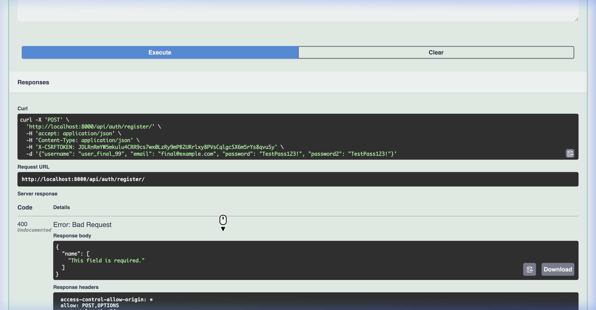

# 🏥 Healthcare Backend API

A production-ready RESTful API backend for healthcare management built with Django REST Framework, featuring JWT authentication, comprehensive API documentation, and robust patient-doctor relationship management.


## 📋 Table of Contents

- [Features](#-features)
- [Tech Stack](#-tech-stack)
- [Quick Start](#-quick-start)
- [API Documentation](#-api-documentation)
- [Project Structure](#-project-structure)
- [Testing](#-testing)
- [Deployment](#-deployment)
- [Environment Variables](#-environment-variables)
- [API Endpoints](#-api-endpoints)
- [Screenshots](#-screenshots)
- [Contributing](#-contributing)
- [License](#-license)

---

## ✨ Features

### Core Functionality
- 🔐 **JWT Authentication** - Secure token-based authentication with SimpleJWT
- 👤 **User Management** - Registration, login, and profile management
- 🏥 **Patient Management** - Complete CRUD operations with user-specific filtering
- 👨‍⚕️ **Doctor Management** - Full doctor profile management
- 🔗 **Patient-Doctor Mapping** - Relationship management with validation
- ✅ **Input Validation** - Comprehensive data validation and error handling
- 🔒 **Security** - Environment-based configuration, CORS, and permission controls

### Professional Features
- 📚 **Swagger/OpenAPI Docs** - Interactive API documentation at `/api/docs/`
- 📊 **Django Admin Panel** - Full-featured admin interface for data management
- 📝 **Logging System** - Rotating logs with configurable levels
- 🧪 **Automated Testing** - Complete test suite with 20+ API calls
- 📮 **Postman Collection** - Pre-configured collection with 15 endpoints
- 🐳 **Docker Support** - Containerized development and production environments
- 🚀 **Production Ready** - Deployment guides for Heroku, AWS, and Docker

---

## 🛠️ Tech Stack

| Technology | Purpose |
|------------|---------|
| **Django 5.0.1** | Web framework |
| **Django REST Framework 3.14.0** | API development |
| **PostgreSQL 15** | Database |
| **SimpleJWT 5.3.1** | JWT authentication |
| **drf-spectacular 0.29.0** | API documentation |
| **Docker & Docker Compose** | Containerization |
| **Gunicorn** | WSGI HTTP server |
| **WhiteNoise** | Static file serving |

---

## 🚀 Quick Start

### Prerequisites

- Python 3.11+
- Docker & Docker Compose
- Git

### Installation

1. **Clone the repository**
   ```bash
   git clone https://github.com/yourusername/healthcare-backend-api.git
   cd healthcare-backend-api
   ```

2. **Create and activate virtual environment**
   ```bash
   python -m venv venv
   
   # On macOS/Linux:
   source venv/bin/activate
   
   # On Windows:
   venv\Scripts\activate
   ```

3. **Install dependencies**
   ```bash
   pip install -r requirements.txt
   ```

4. **Set up environment variables**
   ```bash
   cp .env.example .env
   # Edit .env with your configuration
   ```

5. **Start PostgreSQL database**
   ```bash
   docker-compose up -d
   ```

6. **Run migrations**
   ```bash
   python manage.py makemigrations
   python manage.py migrate
   ```

7. **Create superuser**
   ```bash
   python manage.py createsuperuser
   ```

8. **Start development server**
   ```bash
   python manage.py runserver
   ```

9. **Access the application**
   - API Root: http://127.0.0.1:8000/api/
   - Swagger Docs: http://127.0.0.1:8000/api/docs/
   - ReDoc: http://127.0.0.1:8000/api/redoc/
   - Admin Panel: http://127.0.0.1:8000/admin/

---

## 📚 API Documentation

The API is fully documented using OpenAPI/Swagger specification.

### Access Documentation

- **Swagger UI**: http://127.0.0.1:8000/api/docs/
- **ReDoc**: http://127.0.0.1:8000/api/redoc/
- **OpenAPI Schema**: http://127.0.0.1:8000/api/schema/

### Interactive Testing

Use the Swagger UI to:
- Explore all available endpoints
- View request/response schemas
- Test endpoints directly in the browser
- Download the OpenAPI specification

---

## 📁 Project Structure

```
healthcare-backend-api/
│
├── healthcare_backend/          # Django project configuration
│   ├── settings.py             # Project settings
│   ├── urls.py                 # Main URL routing
│   ├── wsgi.py                 # WSGI configuration
│   └── asgi.py                 # ASGI configuration
│
├── core/                        # Main application
│   ├── models.py               # Database models (Patient, Doctor, Mapping)
│   ├── serializers.py          # DRF serializers with validation
│   ├── views.py                # API viewsets and logic
│   ├── urls.py                 # API endpoint routing
│   └── admin.py                # Django admin configuration
│
├── logs/                        # Application logs
│   └── django.log              # Rotating log file
│
├── nginx/                       # Nginx configuration (production)
│   └── nginx.conf              # Reverse proxy configuration
│
├── manage.py                    # Django management script
├── requirements.txt             # Python dependencies
├── docker-compose.yml           # Docker Compose for development
├── docker-compose.prod.yml      # Docker Compose for production
├── Dockerfile                   # Docker image definition
├── .env                         # Environment variables (not in repo)
├── .env.example                 # Environment variables template
├── .gitignore                   # Git ignore rules
├── Procfile                     # Heroku deployment
├── runtime.txt                  # Python version for Heroku
├── test_api.py                  # Automated API test suite
├── Healthcare_API_Collection.json  # Postman collection
├── DEPLOYMENT.md                # Deployment guide
└── README.md                    # This file
```

---

## 🧪 Testing

### Automated Test Suite

Run the complete test suite that exercises all API endpoints:

```bash
python test_api.py
```

**Test Coverage:**
- ✅ User registration
- ✅ User login (JWT)
- ✅ Create 5 patients
- ✅ Create 3 doctors
- ✅ Create 10 patient-doctor mappings
- ✅ List patients
- ✅ Get doctors for each patient

### Using Postman

1. Import `Healthcare_API_Collection.json` into Postman
2. The collection includes all 15 endpoints
3. JWT token is automatically saved after login
4. Test all CRUD operations interactively

### Manual Testing

Access the browsable API in your browser:
```
http://127.0.0.1:8000/api/
```

Login with admin credentials to test endpoints directly.

---

## 🚀 Deployment

This project includes production-ready deployment configurations for:

### 1. **Heroku** (Platform as a Service)
   - Automated with `Procfile`
   - PostgreSQL add-on integration
   - One-click deployment
   - [See DEPLOYMENT.md](DEPLOYMENT.md#option-1--heroku-with-postgresql-add-on)

### 2. **AWS EC2 + RDS** (Infrastructure as a Service)
   - EC2 for application server
   - RDS for managed PostgreSQL
   - Nginx reverse proxy
   - SSL with Let's Encrypt
   - [See DEPLOYMENT.md](DEPLOYMENT.md#option-2--aws-ec2-with-rds-postgresql)

### 3. **Docker** (Container-based)
   - Multi-stage builds
   - Docker Compose orchestration
   - Nginx reverse proxy
   - Production optimized
   - [See DEPLOYMENT.md](DEPLOYMENT.md#option-3--docker-production-setup)

**📖 Full deployment guide:** [DEPLOYMENT.md](DEPLOYMENT.md)

---

## 🔐 Environment Variables

Create a `.env` file in the project root with the following variables:

```bash
# Django Configuration
SECRET_KEY=your-secret-key-here
DEBUG=True
ALLOWED_HOSTS=localhost,127.0.0.1

# Database Configuration
DATABASE_NAME=healthcare_db
DATABASE_USER=healthcare_user
DATABASE_PASSWORD=your-password-here
DATABASE_HOST=localhost
DATABASE_PORT=5432

# CORS Configuration (optional)
CORS_ALLOWED_ORIGINS=http://localhost:3000
```

**⚠️ Security Note:** Never commit `.env` to version control. Use `.env.example` as a template.

---

## 📡 API Endpoints

### Authentication

| Method | Endpoint | Description | Auth Required |
|--------|----------|-------------|---------------|
| POST | `/api/auth/register/` | Register new user | ❌ |
| POST | `/api/auth/login/` | Login and get JWT tokens | ❌ |

### Patients

| Method | Endpoint | Description | Auth Required |
|--------|----------|-------------|---------------|
| GET | `/api/patients/` | List all patients (user-specific) | ✅ |
| POST | `/api/patients/` | Create new patient | ✅ |
| GET | `/api/patients/{id}/` | Get patient details | ✅ |
| PUT | `/api/patients/{id}/` | Update patient | ✅ |
| DELETE | `/api/patients/{id}/` | Delete patient | ✅ |

### Doctors

| Method | Endpoint | Description | Auth Required |
|--------|----------|-------------|---------------|
| GET | `/api/doctors/` | List all doctors | ✅ |
| POST | `/api/doctors/` | Create new doctor | ✅ |
| GET | `/api/doctors/{id}/` | Get doctor details | ✅ |
| PUT | `/api/doctors/{id}/` | Update doctor | ✅ |
| DELETE | `/api/doctors/{id}/` | Delete doctor | ✅ |

### Patient-Doctor Mappings

| Method | Endpoint | Description | Auth Required |
|--------|----------|-------------|---------------|
| GET | `/api/mappings/` | List all mappings | ✅ |
| POST | `/api/mappings/` | Assign doctor to patient | ✅ |
| GET | `/api/mappings/patient/{id}/` | Get all doctors for a patient | ✅ |
| DELETE | `/api/mappings/{id}/` | Remove doctor assignment | ✅ |

### Example Requests

**Register User:**
```bash
curl -X POST http://127.0.0.1:8000/api/auth/register/ \
  -H "Content-Type: application/json" \
  -d '{
    "name": "John Doe",
    "email": "john@example.com",
    "password": "SecurePass123!",
    "password2": "SecurePass123!"
  }'
```

**Login:**
```bash
curl -X POST http://127.0.0.1:8000/api/auth/login/ \
  -H "Content-Type: application/json" \
  -d '{
    "email": "john@example.com",
    "password": "SecurePass123!"
  }'
```

**Create Patient:**
```bash
curl -X POST http://127.0.0.1:8000/api/patients/ \
  -H "Content-Type: application/json" \
  -H "Authorization: Bearer YOUR_ACCESS_TOKEN" \
  -d '{
    "first_name": "Jane",
    "last_name": "Smith",
    "date_of_birth": "1990-05-15",
    "gender": "F",
    "phone": "1234567890",
    "address": "123 Main St",
    "medical_history": "No known allergies"
  }'
```

---

## 📸 Screenshots

### Swagger API Documentation


### Django Admin Panel


### API Response Example


---

## 🤝 Contributing

Contributions are welcome! Please follow these steps:

1. Fork the repository
2. Create a feature branch (`git checkout -b feature/AmazingFeature`)
3. Commit your changes (`git commit -m 'Add some AmazingFeature'`)
4. Push to the branch (`git push origin feature/AmazingFeature`)
5. Open a Pull Request

### Development Guidelines

- Follow PEP 8 style guide for Python code
- Write meaningful commit messages
- Add tests for new features
- Update documentation as needed
- Ensure all tests pass before submitting PR

---

## 📄 License

This project is licensed under the MIT License - see the [LICENSE](LICENSE) file for details.

---

## 🙏 Acknowledgments

- Django REST Framework documentation and community
- OpenAPI/Swagger specification
- All contributors and users of this project

---

## 📞 Support

If you have any questions or run into issues:

1. Check the [DEPLOYMENT.md](DEPLOYMENT.md) guide
2. Review the [API Documentation](http://127.0.0.1:8000/api/docs/)
3. Open an issue on GitHub
4. Contact: [your-email@example.com](mailto:your-email@example.com)

---

## 🗺️ Roadmap

- [ ] Add email notifications for patient assignments
- [ ] Implement appointment scheduling
- [ ] Add medical records file uploads
- [ ] Create patient portal frontend
- [ ] Add real-time notifications with WebSockets
- [ ] Implement API rate limiting
- [ ] Add multi-language support
- [ ] Create mobile app integration

---

**Made with ❤️ using Django REST Framework**

⭐ Star this repo if you find it helpful!